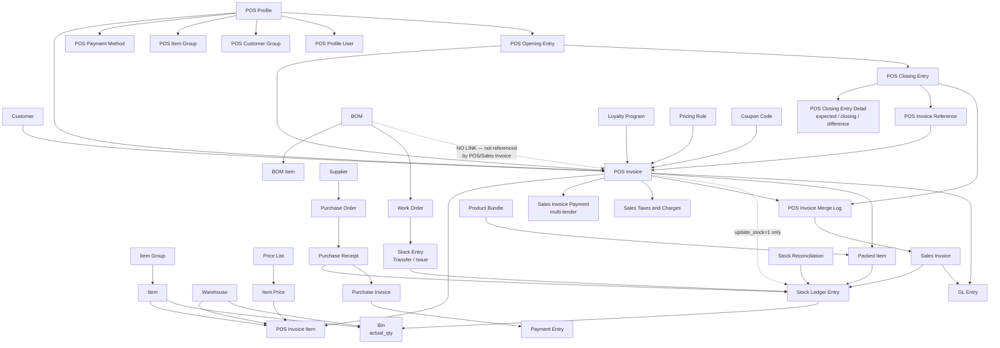

# Frappe / ERPNext Restaurant POS Backend Audit

**Audit date:** 2026-09-11
**Type:** Read-only audit. No code was modified.
**Method:** Direct inspection of local source files. No documentation, no assumptions.

---

## ⚠️ CRITICAL FINDING FIRST — Where the source actually is

The Windows folder you pointed me at is **not** a Frappe bench.

`C:\Users\Muhammad Fawwad\Downloads\medical\clinic-platform\backend\` contains **55 files total** — it is an
editable mirror of one custom app (`clinic_core`) only. It has:

- No `apps/`, no `sites/`, no `apps.txt`, no `apps.json`
- No `hooks.py`, no `modules.txt`, no `pyproject.toml`
- **Zero** matches for `pos`, `restaurant`, `kitchen`, `KOT`, `BOM`, `warehouse` in real code

The real source tree is in **WSL2 Ubuntu-24.04**, confirmed by
[scripts/sync_clinic_core.sh:11-12](scripts/sync_clinic_core.sh#L11-L12):

```
/home/fawwad/projects/clinic-platform/backend/frappe-bench/apps/
```

**Everything below is audited from that real tree**, not from the Windows mirror.

A second critical point: this is a **medical clinic backend**. Nothing restaurant-related has been
built here. What you have is stock ERPNext v16 plus a healthcare app. The POS capability you're
asking about is entirely ERPNext's generic retail POS, unmodified.

---

## PHASE 1 — Installed Apps

Source: `frappe-bench/sites/apps.txt` and each app's `__init__.py`.

| App | Exists | Version if found | Purpose |
|---|---|---|---|
| frappe | **Yes** | `16.33.1` | Framework (`apps/frappe/frappe/__init__.py`) |
| erpnext | **Yes** | `16.34.2` | ERP — provides ALL POS/stock/accounting |
| payments | **No** | — | NOT FOUND. Not in `apps.txt`, not in `apps/` |
| restaurant app | **No** | — | **NOT FOUND.** `find apps -type d -iname "*restaurant*"` → zero results |
| healthcare (Marley) | **Yes** | `16.5.2` | Clinic domain — irrelevant to POS |
| clinic_core (custom) | **Yes** | `0.0.1` | Your custom app. Clinic APIs only — **zero POS code** |

**ERPNext modules present** (`erpnext/modules.txt`): Accounts, CRM, Buying, Projects, Selling,
Setup, Manufacturing, Stock, Support, Utilities, Assets, Portal, Maintenance, Regional,
ERPNext Integrations, Quality Management, Communication, Telephony, Bulk Transaction,
Subcontracting, EDI.

**Custom app check:** `clinic_core/hooks.py` has `doc_events`, `override_whitelisted_methods`,
and `scheduler_events` **all commented out** (lines 147, 158, 192). It adds two DocTypes only:
`Patient OTP Request` and `Patient Phone Mapping`. It contributes nothing to POS.

---

## PHASE 2 — POS Modules Found

All POS code lives in **`erpnext/accounts/doctype/`** and **`erpnext/selling/page/`**.
There is no `erpnext/restaurant/` — that path does not exist.

### POS DocTypes that actually exist

| DocType | Location |
|---|---|
| POS Invoice | `erpnext/accounts/doctype/pos_invoice/` |
| POS Invoice Item | `erpnext/accounts/doctype/pos_invoice_item/` |
| POS Profile | `erpnext/accounts/doctype/pos_profile/` |
| POS Profile User | `erpnext/accounts/doctype/pos_profile_user/` |
| POS Opening Entry | `erpnext/accounts/doctype/pos_opening_entry/` |
| POS Opening Entry Detail | `erpnext/accounts/doctype/pos_opening_entry_detail/` |
| POS Closing Entry | `erpnext/accounts/doctype/pos_closing_entry/` |
| POS Closing Entry Detail | `erpnext/accounts/doctype/pos_closing_entry_detail/` |
| POS Closing Entry Taxes | `erpnext/accounts/doctype/pos_closing_entry_taxes/` |
| POS Invoice Merge Log | `erpnext/accounts/doctype/pos_invoice_merge_log/` |
| POS Invoice Reference | `erpnext/accounts/doctype/pos_invoice_reference/` |
| POS Payment Method | `erpnext/accounts/doctype/pos_payment_method/` |
| POS Item Group | `erpnext/accounts/doctype/pos_item_group/` |
| POS Customer Group | `erpnext/accounts/doctype/pos_customer_group/` |
| POS Search Fields | `erpnext/accounts/doctype/pos_search_fields/` |
| POS Field | `erpnext/accounts/doctype/pos_field/` |
| POS Settings | `erpnext/accounts/doctype/pos_settings/` |

### POS frontend + reports + print formats

- **POS UI page:** `erpnext/selling/page/point_of_sale/` — `point_of_sale.py`, `.js`, `.json`
- **JS bundle:** `erpnext/public/js/point-of-sale.bundle.js`; built: `erpnext/public/dist/js/point-of-sale.bundle.USGGAUZO.js`
- **Styles:** `erpnext/public/scss/point-of-sale.scss`
- **Report:** `erpnext/accounts/report/pos_register/`
- **Print formats:** `erpnext/accounts/print_format/pos_invoice/`, `pos_invoice_standard/`,
  `pos_invoice_with_item_image/`; `erpnext/selling/print_format/pos_invoice/`, `return_pos_invoice/`

### Detailed record — POS Invoice

```
DocType:            POS Invoice
Location:           erpnext/accounts/doctype/pos_invoice/
Python controller:  pos_invoice.py (1119 lines)
                    class POSInvoice(SalesInvoice)  — line 30
JSON schema:        pos_invoice.json
Client JS:          pos_invoice.js, pos_invoice_list.js
Important fields:   update_stock (line 591), is_return, payments, loyalty_program,
                    change_amount, outstanding_amount, consolidated_invoice, pos_profile
Important funcs:    validate() 199, before_submit() 237, on_submit() 240,
                    before_cancel() 266, on_cancel() 285,
                    validate_stock_availablility() 393, validate_change_amount() 545,
                    validate_payment_amount() 557, set_pos_fields() 659
APIs:               set_missing_values() 757, reset_mode_of_payments() 791,
                    create_payment_request() 798, update_payments() 858,
                    get_stock_availability() 900, make_sales_return() 1023,
                    make_merge_log() 1030, item_query() 1079
Dependencies:       Inherits SalesInvoice → SellingController → AccountsController
```

---

## PHASE 3 — POS Invoice Feature Proof

All line numbers from `erpnext/accounts/doctype/pos_invoice/pos_invoice.py` unless noted.

| Feature | Status | Proof |
|---|---|---|
| Create / update / draft | **PRESENT** | Standard Frappe doc lifecycle; `validate()` line 199 |
| Submit | **PRESENT** | `on_submit()` line 240 |
| Cancel | **PRESENT** | `on_cancel()` line 285; `before_cancel()` 266 blocks cancel if consolidated |
| Returns | **PRESENT** | `make_sales_return()` line 1023 → `erpnext/controllers/sales_and_purchase_return.py:make_return_doc`; `validate_return_items_qty()` line 490 |
| Refunds | **PRESENT** | `create_return_sales_invoice()` line 316; credit notes via `process_merging_into_credit_notes()` in `pos_invoice_merge_log.py:162` |
| Customer selection | **PRESENT** | `customer` field; `set_customer_info()` in `point_of_sale.py:434` |
| Item selection | **PRESENT** | `item_query()` line 1079; `get_items()` in `point_of_sale.py:135` |
| Quantity / price | **PRESENT** | POS Invoice Item child table (`qty`, `rate`) |
| Discounts | **PRESENT** | `apply_discount_on`, `discount_amount`, `discount_percentage`; Pricing Rule engine |
| Taxes | **PRESENT** | `taxes` table → `Sales Taxes and Charges`; `taxes_and_charges` template |
| Service charges | **PARTIAL** | No named "service charge" field. Achievable as a Sales Taxes and Charges row (`Actual`/`On Net Total`). Configuration, not code. |
| Multiple payment methods | **PRESENT** | `payments` child table (`Sales Invoice Payment`); `validate_payment_amount()` 557; `validate_mode_of_payment()` 529 |
| Cash / card | **PRESENT** | Driven by `Mode of Payment` + `POS Payment Method` |
| Change amount | **PRESENT** | `validate_change_amount()` line 545; `validate_change_account()` 533; `account_for_change_amount` on POS Profile |
| Outstanding amount | **PRESENT** | `set_outstanding_amount()` line 580, called in `before_submit()` 237 |
| Loyalty points | **PRESENT** | `validate_loyalty_transaction()` 584; `make_loyalty_point_entry()` / `apply_loyalty_points()` in `on_submit()` 240-248; DocTypes `loyalty_program`, `loyalty_point_entry` |
| Customer credit | **PRESENT** | `outstanding_amount` + Payment Entry allocation |
| Warehouse selection | **PRESENT** | `warehouse` on POS Profile and per item row |
| Stock update | **PRESENT (conditional)** | `update_stock` field line 591 — see Phase 7 |
| Invoice printing | **PRESENT** | 5 POS print formats (Phase 18) |
| Coupons | **PRESENT** | `coupon_code` → `update_coupon_code_count()` in `on_submit()` 261-264 and `on_cancel()` |

---

## PHASE 4 — POS Profile

Fields extracted directly from `pos_profile.json`:

| Requested | Status | Field |
|---|---|---|
| Default warehouse | **PRESENT** | `warehouse` |
| Company | **PRESENT** | `company`, `company_address`, `country` |
| Currency | **PRESENT** | `currency` |
| Payment methods | **PRESENT** | `payments` (child: POS Payment Method) |
| Item groups | **PRESENT** | `item_groups` (child: POS Item Group) |
| Customer groups | **PRESENT** | `customer_groups` (child: POS Customer Group) |
| Price list | **PRESENT** | `selling_price_list` |
| Taxes | **PRESENT** | `taxes_and_charges`, `tax_category`, `apply_discount_on` |
| Users / cashier | **PRESENT** | `applicable_for_users` (child: POS Profile User) |
| Print format | **PRESENT** | `print_format`, `letter_head`, `select_print_heading`, `print_receipt_on_order_complete` |
| Warehouse restrictions | **PRESENT** | `warehouse` + `hide_unavailable_items`, `validate_stock_on_save` |
| Branch/location restrictions | **PARTIAL** | Via `company` + `cost_center` + `warehouse` + User Permission. No `branch` field on POS Profile. |

Also present: `update_stock`, `ignore_pricing_rule`, `allow_rate_change`, `allow_discount_change`,
`write_off_account`, `write_off_limit`, `income_account`, `expense_account`, `cost_center`,
`allow_partial_payment`, `set_grand_total_to_default_mop`, `auto_add_item_to_cart`.

**Multiple terminals per company: YES.** POS Profile has no uniqueness constraint on `company`.
Cashier binding is enforced per-profile by `validate_pos_profile_and_cashier()`
(`pos_opening_entry.py:45`) and `check_user_already_assigned()` (line 73).

So **Branch A / Branch B / Restaurant Floor / Takeaway Counter / Delivery Counter can each be a
separate POS Profile** — different warehouse, price list, payment methods, users, print format.
This is configuration and needs no code.

⚠️ Caveat: these are just five profiles. The profile does **not** carry any order-type semantics.
"Takeaway" vs "Delivery" would be a name only — no different tax, routing, or workflow behaviour
attaches to it without custom code.

---

## PHASE 5 — POS Opening and Closing

**Both exist and implement the full shift cycle.**

`POS Opening Entry` — `erpnext/accounts/doctype/pos_opening_entry/pos_opening_entry.py`
Fields: `period_start_date`, `period_end_date`, `posting_date`, `company`, `pos_profile`, `user`,
`status`, `pos_closing_entry`, `balance_details`.
Functions: `validate()` 38, `validate_pos_profile_and_cashier()` 45, `check_open_pos_exists()` 64,
`check_user_already_assigned()` 73, `validate_payment_method_account()` 80, `on_submit()` 99.

`POS Closing Entry` — `pos_closing_entry.py`
Functions: `validate()` 60, `validate_pos_opening_entry()` 75, `validate_pos_invoices()` 106,
`on_submit()` 209, `get_cashiers()` 256, `get_invoices()` 262, `get_payments()` 284,
`get_taxes()` 318, `make_closing_entry_from_opening()` 342.

**Cash reconciliation proof** — `pos_closing_entry_detail.json` fields:

```
mode_of_payment, opening_amount, expected_amount, closing_amount, difference
```

That is exactly your requested flow:

| Your step | Implementation |
|---|---|
| Cashier opens shift | `POS Opening Entry` + `create_opening_voucher()` (`point_of_sale.py:343`) |
| Opening cash entered | `balance_details` → `opening_amount` |
| POS sales | POS Invoice docs |
| Cash/Card payments | `payments` table per invoice |
| Cashier closes shift | `make_closing_entry_from_opening()` line 342 |
| Expected cash calculated | `get_payments()` line 284 → `expected_amount` |
| Actual cash entered | `closing_amount` |
| Difference calculated | `difference` field |

**"Cash drawer" as hardware: NOT FOUND.** No drawer-kick code exists. The reconciliation is
bookkeeping only.

---

## PHASE 6 — Inventory / Stock

| Feature | Status | Proof |
|---|---|---|
| Stock ledger | **PRESENT** | `erpnext/stock/doctype/stock_ledger_entry/`; engine `erpnext/stock/stock_ledger.py` |
| Warehouses | **PRESENT** | `erpnext/stock/doctype/warehouse/` (tree), `warehouse_type/` |
| Current / available stock | **PRESENT** | `erpnext/stock/doctype/bin/` (`actual_qty`, `reserved_qty`, `projected_qty`) |
| Stock balance | **PRESENT** | `erpnext/stock/report/stock_balance/`, `warehouse_wise_stock_balance/`, `quick_stock_balance/` |
| Stock entry | **PRESENT** | `erpnext/stock/doctype/stock_entry/`, `stock_entry_type/` |
| Stock transfer | **PRESENT** | Stock Entry type "Material Transfer" |
| Stock adjustment | **PRESENT** | `erpnext/stock/doctype/stock_reconciliation/` |
| Stock receiving | **PRESENT** | `erpnext/stock/doctype/purchase_receipt/` |
| Purchase receipt | **PRESENT** | same as above |
| Supplier purchases | **PRESENT** | `erpnext/buying/doctype/purchase_order/`, `supplier/` |
| Stock reconciliation | **PRESENT** | `stock_reconciliation/`, `stock_reconciliation_item/` |
| Damaged stock / wastage | **PARTIAL** | No "wastage" DocType. Stock Entry "Material Issue" + a dedicated expense account / Waste warehouse. Configuration + convention, not a feature. |
| Batch tracking | **PRESENT** | `erpnext/stock/doctype/batch/`, `serial_and_batch_bundle/`, `serial_and_batch_entry/` |
| Serial numbers | **PRESENT** | `erpnext/stock/doctype/serial_no/` |
| Expiry dates | **PRESENT** | `expiry_date` on Batch; `batch_wise_balance_history` report |
| Units of measure | **PRESENT** | `erpnext/stock/doctype/uom_category/`, `uom_conversion_detail/` |
| Conversion factors | **PRESENT** | `uom_conversion_detail`; `get_conversion_factor()` used at `selling_controller.py:662` |
| Reorder levels | **PRESENT** | `erpnext/stock/doctype/item_reorder/`; report `itemwise_recommended_reorder_level/` |
| Low-stock alerts | **PARTIAL** | Reorder triggers Material Request; no push/notification channel out of the box |
| Valuation rate | **PRESENT** | `valuation_rate` on Bin / SLE |
| Moving average | **PRESENT** | `valuation_method` on Item / Stock Settings |
| FIFO | **PRESENT** | FIFO queue in `erpnext/stock/stock_ledger.py` |

Also found: `landed_cost_voucher/`, `putaway_rule/`, `pick_list/`, `material_request/`,
`inventory_dimension/`, `stock_closing_entry/`, `repost_item_valuation/`,
`stock_reservation_entry/`, `item_alternative/`, `quality_inspection/`.

---

## PHASE 7 — POS Sale → Stock Deduction (Code Trace)

**This is the most important mechanical finding in the audit, and it has a branch.**

`POSInvoice.on_submit()` (line 240) does **NOT** call `update_stock_ledger()`.
I read the whole method — it does loyalty, serial/batch bundles, coupon counts, status, and
consolidation. **No stock ledger call.** Stock movement is inherited and conditional.

### Path A — `update_stock = 1` (deduct immediately at POS submit)

```
POS UI / REST API
   ↓
POS Invoice.submit()
   ↓
POSInvoice.on_submit()               pos_invoice.py:240
   ↓  (inherits SalesInvoice)
SalesInvoice.on_submit()             sales_invoice.py:469
   ↓  guarded by: if self.update_stock == 1
self.update_stock_ledger()           sales_invoice.py:503
   ↓
SellingController.update_stock_ledger()   selling_controller.py:653
   ↓  iterates self.get_item_list()       selling_controller.py:342
   ↓  filters is_stock_item == 1          selling_controller.py:659
get_sle_for_source_warehouse(d)      selling_controller.py:672
   ↓
make_sl_entries()                    erpnext/stock/stock_ledger.py
   ↓
Stock Ledger Entry rows written
   ↓
Bin.actual_qty updated → warehouse stock reduced
   ↓
self.make_gl_entries()               sales_invoice.py:510
   ↓
self.repost_future_sle_and_gle()     sales_invoice.py:518-519
```

### Path B — `update_stock = 0` (default POS consolidation flow)

Stock is **not** deducted at POS Invoice submit. It is deducted later:

```
POS Invoice (submitted, no stock movement)
   ↓
POS Closing Entry.on_submit()           pos_closing_entry.py:209
   ↓
consolidate_pos_invoices()              pos_invoice_merge_log.py:493
   ↓
create_merge_logs()                     pos_invoice_merge_log.py:574
   ↓
POS Invoice Merge Log.on_submit()       pos_invoice_merge_log.py:116
   ↓
process_merging_into_sales_invoice()    pos_invoice_merge_log.py:143
   ↓
get_new_sales_invoice()  → is_pos = 1   pos_invoice_merge_log.py:361
   ↓
Sales Invoice.submit() → update_stock_ledger() → SLE → Bin
```

### Direct answer: when is stock deducted?

- **NOT when the invoice is saved.** Only `validate_stock_availablility()` (line 393) runs — a
  read-only availability check using `get_stock_availability()` (line 900), which reads
  `Bin` qty minus `get_pos_reserved_qty()`. It checks; it does not deduct.
- **NOT when payment happens.** Payment rows carry no stock logic.
- **On submit — IF `update_stock = 1`** on the POS Invoice / POS Profile.
- **Otherwise at POS Closing Entry → Merge Log → Sales Invoice submit.**

⚠️ **Restaurant implication:** `update_stock` is a **hidden field** on POS Profile
(`pos_profile.json:334-337`, `"hidden": 1`). For a restaurant you almost certainly want
`update_stock = 1` so ingredient depletion is real-time rather than at end of shift. This must be
set deliberately.

---

## PHASE 8 — Restaurant Features

**Search performed:** `find apps -type d -iname "*restaurant*"` → **zero results** across all four apps.
Same for `*kitchen*`, `*kot*`, `*waiter*`. The only `*reservation*` hit is
`erpnext/stock/doctype/stock_reservation_entry/`, which reserves **inventory quantity**, not tables.

| Feature | Status | Finding |
|---|---|---|
| Restaurant Tables | **NOT FOUND** | No Table DocType. (ERPNext v10–v12 had a `restaurant` module; it was removed and is **not** in 16.34.2.) |
| Order linked to a table | **NOT FOUND** | No table field on POS Invoice |
| Dine In | **NOT FOUND** | No order-type field |
| Takeaway | **NOT FOUND** | No order-type field |
| Delivery | **NOT FOUND** | No restaurant delivery. `delivery_note`/`delivery_trip` are logistics, not food service. |
| Waiter / server / captain | **NOT FOUND** | Closest is `Sales Person`, unrelated to service flow |
| Floor / section | **NOT FOUND** | `plant_floor` exists but is Manufacturing |
| Table reservation | **NOT FOUND** | — |
| Table transfer (T4 → T8) | **NOT FOUND** | No table concept to transfer between |
| Table merge | **NOT FOUND** | — |
| Split bill — by amount | **PARTIAL** | Multiple payment rows split *tender*, not the bill |
| Split bill — by item | **NOT FOUND** | No split logic |
| Split bill — by customer | **PARTIAL** | Separate POS Invoices per customer, done manually |
| Split bill — by payment method | **PRESENT** | `payments` child table — this genuinely works |
| Course / seat management | **NOT FOUND** | — |
| Hold / fire order | **NOT FOUND** | Draft invoices are the nearest analogue |

**Conclusion: restaurant operations are completely absent.** ERPNext v16 here is a **retail** POS.

---

## PHASE 9 — Kitchen / KOT / KDS

**Every item: NOT FOUND.**

| Feature | Status |
|---|---|
| Kitchen Order Ticket | **NOT FOUND** |
| KOT generation | **NOT FOUND** |
| Kitchen stations | **NOT FOUND** |
| Kitchen display system | **NOT FOUND** |
| Order status (preparing/ready/served) | **NOT FOUND** — POS Invoice `status` is financial (Draft/Paid/Return/Consolidated), set by `set_status()` line 599 |
| Item notes / kitchen notes | **PARTIAL** — a generic `description` field exists on the item row; nothing routes it |
| Printer routing per station | **NOT FOUND** |
| Burger→Grill, Pizza→Pizza, Tea→Beverage routing | **NOT FOUND** — no routing code of any kind |

There is no kitchen concept anywhere in the codebase. This must be built from scratch.

---

## PHASE 10 — Recipes / Ingredients / BOM ⭐ THE CRITICAL CHECK

### What exists

**BOM is fully present** — `erpnext/manufacturing/doctype/`: `bom/`, `bom_item/`,
`bom_creator/`, `bom_explosion_item/`, `bom_operation/`, `bom_update_tool/`, plus `work_order/`,
`job_card/`, `production_plan/`, `routing/`, `workstation/`.

So you **can** define:

```
Zinger Burger (BOM)
  Bun      1 pcs
  Chicken  150 g
  Cheese   1 slice
  Sauce    20 g
```

### The decisive finding

I grepped for BOM usage in the sales path:

```bash
grep -rn "bom_no|\"BOM\"" erpnext/accounts/doctype/pos_invoice/pos_invoice.py \
                          erpnext/accounts/doctype/sales_invoice/sales_invoice.py
→ ZERO MATCHES
```

**Neither POS Invoice nor Sales Invoice references BOM at all.**

Confirmed structurally: `SellingController.update_stock_ledger()` (`selling_controller.py:653`)
builds entries from `get_item_list()` (line 342), which iterates **only** `self.items` and
`self.packed_items`. There is no BOM explosion anywhere in that path.

### Direct answer to your critical question

Selling **1 Zinger Burger** via POS Invoice will:

✅ Deduct `Zinger Burger -1` (finished-good stock), if `Zinger Burger` is a stock item and
`update_stock = 1`

❌ **NOT** deduct `Bun -1`, `Chicken -150 g`, `Cheese -1`, `Sauce -20 g`

**Ingredient-level deduction from a BOM does NOT happen on a POS sale. There is no code for it.**

To get ingredient depletion you must use one of:

1. **Manufacturing** — Work Order + Stock Entry ("Manufacture") consumes raw materials and produces
   the finished item. Heavy: a Work Order per burger is impractical at POS speed.
2. **Periodic backflush** — a scheduled Stock Entry consuming ingredients based on items sold.
   **Custom code required.**
3. **Product Bundle** — works natively, with a hard limitation (Phase 11).

---

## PHASE 11 — Product Bundles

**Product Bundle child items DO reduce inventory.** Proven:

`erpnext/controllers/selling_controller.py:342-362` — `get_item_list()`:

```python
for d in self.get("items"):
    if self.has_product_bundle(d.item_code):          # line 345
        for p in self.get("packed_items"):            # line 346
            if p.parent_detail_docname == d.name and p.parent_item == d.item_code:
                il.append(frappe._dict({
                    "warehouse": p.warehouse or d.warehouse,
                    "item_code": p.item_code,
                    "qty": flt(p.qty),                # "already multiplied with parent's qty"
                    ...
```

That list feeds `update_stock_ledger()` → SLE → Bin. So **child ingredients are the things that
move stock**, and quantities are multiplied by the parent qty.

Population: `make_packing_list(doc)` — `erpnext/stock/doctype/packed_item/packed_item.py:69`,
invoked from `erpnext/controllers/accounts_controller.py:4301`.

POS support: `get_stock_availability()` (`pos_invoice.py:900`) explicitly handles bundles —
`if frappe.db.exists("Product Bundle", {"name": item_code, "disabled": 0})` →
`get_bundle_availability(item_code, warehouse)`.

### The hard limitation

`erpnext/selling/doctype/product_bundle/product_bundle.py:76-79`:

```python
def validate_main_item(self):
    """Validates, main Item is not a stock item"""
    if frappe.db.get_value("Item", self.new_item_code, "is_stock_item"):
        frappe.throw(_("Parent Item {0} must not be a Stock Item"))
```

Reinforced at line 117: the bundle-item search query filters `is_stock_item == 0`.
And line 85: a child **cannot itself be a Product Bundle** — so **no nested recipes**.

### Verdict for restaurant use

```
Burger (non-stock parent)
 ├── Bun      1     → deducted ✅
 ├── Chicken  150 g → deducted ✅
 ├── Cheese   1     → deducted ✅
 └── Sauce    20 g  → deducted ✅
```

**This is the one native way to get real ingredient deduction from a POS sale.** It works today,
no code.

Limitations you must accept:

1. **The menu item can never hold stock.** You cannot track "12 pre-made burgers in the warming
   tray" — the parent is non-stock by enforcement.
2. **No nesting.** A "Burger Combo" containing a "Burger" bundle is rejected (line 85). Sub-recipes
   (a house sauce made from 5 ingredients) cannot be modelled.
3. **No yield, wastage %, or cooking loss** — BOM has these; Product Bundle does not.
4. **Fixed quantities only.** No size variants without a separate bundle per size.
5. **No costing rollup.** BOM computes cost; Product Bundle does not.

---

## PHASE 12 — Purchases and Suppliers

| Feature | Status | Location |
|---|---|---|
| Supplier | **PRESENT** | `erpnext/buying/doctype/supplier/` |
| Purchase Order | **PRESENT** | `erpnext/buying/doctype/purchase_order/` |
| Purchase Receipt | **PRESENT** | `erpnext/stock/doctype/purchase_receipt/` |
| Purchase Invoice | **PRESENT** | `erpnext/accounts/doctype/purchase_invoice/` |
| Purchase Return | **PRESENT** | `is_return` + `erpnext/controllers/sales_and_purchase_return.py` |
| Supplier Payment | **PRESENT** | `erpnext/accounts/doctype/payment_entry/` |
| Supplier Credit | **PRESENT** | Debit Note / outstanding on Purchase Invoice |
| Landed Cost | **PRESENT** | `erpnext/stock/doctype/landed_cost_voucher/` + `landed_cost_item/`, `landed_cost_taxes_and_charges/` |
| Supplier Quotation / RFQ | **PRESENT** | `supplier_quotation/`, `request_for_quotation/` |
| Supplier Scorecard | **PRESENT** | `supplier_scorecard/` + 7 related child DocTypes |

**Your trace (50 kg chicken, 100 buns, 20 kg potatoes) works:**

```
Purchase Order (optional)
   ↓
Purchase Receipt.submit()
   ↓
BuyingController.update_stock_ledger()   erpnext/controllers/buying_controller.py:806
   ↓
make_sl_entries() → Stock Ledger Entry (positive qty)
   ↓
Bin.actual_qty increased in target warehouse
   ↓
Purchase Invoice → supplier payable → Payment Entry
```

Fully native, no customization.

---

## PHASE 13 — Multi-Warehouse

**PRESENT and native.**

`erpnext/stock/doctype/warehouse/` is a **tree DocType** (nested set: `lft`, `rgt`, `parent_warehouse`),
so your structure is directly expressible:

```
Restaurant (group)
├── Main Store
├── Kitchen Store
├── Bar Store
└── Waste Store
```

Transfers: **Stock Entry** with `stock_entry_type = "Material Transfer"`
(`erpnext/stock/doctype/stock_entry/stock_entry.py`), using `s_warehouse` → `t_warehouse` per row.
Two SLEs are written per row (negative at source, positive at target).

Also available: `putaway_rule/`, `inventory_dimension/`, `warehouse_type/`,
report `warehouse_wise_stock_balance/`.

Waste tracking: model "Waste Store" as a warehouse and transfer into it, or use Stock Entry
"Material Issue" against an expense account. Native mechanics; **the wastage *workflow* — reason
codes, approvals, waste reports — is convention, not a feature.**

---

## PHASE 14 — Multi-Branch

| Mechanism | Status | Location |
|---|---|---|
| Company | **PRESENT** | `erpnext/setup/doctype/company/` |
| Cost Center | **PRESENT** | `erpnext/accounts/doctype/cost_center/` (tree) + `cost_center_allocation/` |
| Warehouse | **PRESENT** | tree, per-branch subtrees |
| POS Profile | **PRESENT** | one per terminal/branch |
| User Permission | **PRESENT** | `frappe/core/doctype/user_permission/` |
| Accounting Dimension | **PRESENT** | `erpnext/accounts/doctype/accounting_dimension/` + `accounting_dimension_filter/` |
| **Branch DocType** | **PRESENT** | `erpnext/setup/doctype/branch/` — **it does exist** |

Your Karachi / Lahore / Islamabad structure is achievable **two ways**:

1. **Separate Company per branch** — hard isolation, separate books. Heavier; inter-branch transfers
   become inter-company.
2. **One Company + Cost Center per branch** (recommended) — Branch or Cost Center registered as an
   **Accounting Dimension**, so it flows onto every transaction and every financial report.

**Branch isolation verdict: PARTIAL / configuration-native.**
The `Branch` DocType is a bare label — it has no permission logic attached. Actual isolation comes
from **User Permission** records (user → allowed Company / Cost Center / Warehouse / POS Profile),
which Frappe enforces in query generation automatically. That is native behaviour, but it is
**setup work per user**, not a switch. There is no "branch manager sees only his branch" role
out of the box.

---

## PHASE 15 — Roles and Permissions

**Framework: fully PRESENT.** `frappe/core/doctype/`: `role/`, `has_role/`, `docperm/`,
`custom_docperm/`, `custom_role/`, `role_profile/`, `user_role/`, `user_role_profile/`,
`user_permission/`, `role_permission_for_page_and_report/`.

Two layers:
- **Role Permissions (DocPerm)** — *what DocTypes* a role may read/write/submit/cancel, with
  `if_owner`, per-field `permlevel`, and report/export/share flags.
- **User Permissions** — *which records* a user may see (e.g. user X → Company "Karachi" only).
  Applied automatically in query building.

POS-relevant roles found in source: `pos_profile.json:587,596` grants **Accounts Manager** and
**Accounts User**. ERPNext ships Stock Manager, Stock User, Purchase Manager, Purchase User,
Sales Manager, Sales User, Accounts Manager, Accounts User, Item Manager.

| Your role | Status | How |
|---|---|---|
| Owner / Admin | **PRESENT** | System Manager / Administrator |
| Branch Manager | **PARTIAL** | Custom Role + User Permission on Company/Cost Center. No such role ships. |
| Cashier | **PARTIAL** | No "Cashier" role ships. `get_cashiers()` (`pos_closing_entry.py:256`) resolves cashiers from **POS Profile `applicable_for_users`**, not from a role. Create a custom role + restrict to POS Invoice. |
| Waiter | **NOT FOUND** | Nothing to permission — no waiter/table/order concept exists |
| Kitchen User | **NOT FOUND** | No kitchen screen exists to restrict |
| Inventory Manager | **PRESENT** | Stock Manager / Stock User ship with ERPNext |
| Accountant | **PRESENT** | Accounts Manager / Accounts User |

**Verdict:** the permission *engine* is strong and genuinely capable of your matrix. But roles for
Waiter/Kitchen are meaningless until those features exist. Cashier/Branch Manager are
custom-role + User-Permission configuration.

---

## PHASE 16 — Payments

| Feature | Status | Proof |
|---|---|---|
| Mode of Payment | **PRESENT** | `erpnext/accounts/doctype/mode_of_payment/` + `mode_of_payment_account/` |
| Payment Entry | **PRESENT** | `erpnext/accounts/doctype/payment_entry/` |
| POS payment rows | **PRESENT** | `payments` child table (Sales Invoice Payment); POS Payment Method on Profile |
| Cash / bank / card | **PRESENT** | Mode of Payment `type` = Cash / Bank / Phone |
| Wallet | **PARTIAL** | Model as a Mode of Payment. No wallet integration code; `payments` app NOT installed. |
| **Multiple payments** | **PRESENT** | `validate_payment_amount()` `pos_invoice.py:557` |
| Partial payments | **PRESENT** | `allow_partial_payment` on POS Profile; `set_outstanding_amount()` line 580 |
| Overpayments | **PRESENT** | `validate_change_amount()` line 545 → change |
| Change amount | **PRESENT** | `change_amount` + `account_for_change_amount` |
| Outstanding payments | **PRESENT** | `outstanding_amount` |
| Refunds | **PRESENT** | `make_sales_return()` line 1023; `create_return_sales_invoice()` line 316 |
| Phone/QR payments | **PRESENT** | `check_phone_payments()` line 374; `create_payment_request()` line 798 |

**Your Rs 5,000 = Cash 2,000 + Card 3,000 split: SUPPORTED natively.** Two rows in `payments`,
each with its own Mode of Payment and amount. `validate_payment_amount()` reconciles the sum
against the grand total; `clear_unallocated_mode_of_payments()` (line 305) strips zero rows on submit.

---

## PHASE 17 — Taxes and Discounts

| Feature | Status | Location |
|---|---|---|
| Item discount | **PRESENT** | `discount_percentage`, `discount_amount` on item row |
| Invoice discount | **PRESENT** | `additional_discount_percentage`, `discount_amount`, `apply_discount_on` |
| Percentage discount | **PRESENT** | as above |
| Fixed discount | **PRESENT** | as above |
| Taxes | **PRESENT** | `erpnext/accounts/doctype/sales_taxes_and_charges/` + `_template/` |
| Inclusive tax | **PRESENT** | `included_in_print_rate` on the tax row |
| Exclusive tax | **PRESENT** | default behaviour |
| Service charge | **PARTIAL** | No dedicated field. Add a Sales Taxes and Charges row of type `Actual` / `On Net Total`. Configuration. |
| Tax templates | **PRESENT** | `sales_taxes_and_charges_template/`; `taxes_and_charges` + `tax_category` on POS Profile |
| Item tax templates | **PRESENT** | `erpnext/accounts/doctype/item_tax_template/` + `_detail/` |
| Price rules | **PRESENT** | `erpnext/accounts/doctype/pricing_rule/` + `pricing_rule_item_code/`, `_item_group/`, `_brand/`, `_detail/` |
| Coupons | **PRESENT** | `erpnext/accounts/doctype/coupon_code/`; `update_coupon_code_count()` wired into `pos_invoice.py:261` |
| Promotional pricing | **PRESENT** | `promotional_scheme/` + `promotional_scheme_price_discount/`, `_product_discount/` |
| Price lists | **PRESENT** | `erpnext/stock/doctype/price_list/`, `item_price/`; `selling_price_list` on POS Profile |
| Loyalty | **PRESENT** | `loyalty_program/`, `loyalty_point_entry/`, `loyalty_program_collection/` |

Happy-hour / time-based pricing: Pricing Rule supports `valid_from`/`valid_upto` **dates**.
Time-of-day pricing is **NOT FOUND** — would need custom code.

---

## PHASE 18 — Printing

### Backend print-format support — PRESENT

- Engine: `frappe/printing/` — `print_format/`, `print_settings/`, `print_style/`,
  `print_format_field_template/`; renderer `frappe/www/printview.py`
- **POS print formats shipped (5):**
  - `erpnext/accounts/print_format/pos_invoice/`
  - `erpnext/accounts/print_format/pos_invoice_standard/`
  - `erpnext/accounts/print_format/pos_invoice_with_item_image/`
  - `erpnext/selling/print_format/pos_invoice/`
  - `erpnext/selling/print_format/return_pos_invoice/`
- PDF: `frappe/utils/pdf.py`; endpoint `frappe.utils.print_format.download_pdf`
- POS Profile fields: `print_format`, `letter_head`, `print_receipt_on_order_complete`

### Raw / thermal printing — PARTIAL

**Proof it exists:** `frappe/printing/doctype/print_format/print_format.py:48-49`

```python
raw_commands: DF.Code | None
raw_printing: DF.Check
```

Validated at lines 97 and 100. So Frappe **can** emit raw ESC/POS command strings from a
print format.

| Target | Status |
|---|---|
| Customer receipt | **PRESENT** — 5 POS formats |
| POS invoice | **PRESENT** |
| A4 invoice | **PRESENT** |
| PDF invoice | **PRESENT** |
| Thermal / ESC/POS payload | **PARTIAL** — `raw_printing` + `raw_commands` generate the payload |
| **Kitchen ticket** | **NOT FOUND** — no KOT format exists |

### Direct hardware printing — NOT FOUND in backend

No QZ Tray code, no network-printer driver, no CUPS integration in any installed app.
Frappe produces the **payload**; getting bytes to a physical printer is the client's job
(browser print dialog, QZ Tray, or your own print agent). **This is a real gap for a restaurant** —
kitchen printing must be silent and automatic, which no browser dialog can do. You will need a
small local print service.

---

## PHASE 19 — APIs for a Custom Frontend

Frappe exposes a generic REST layer — `frappe/api/v1.py`, `frappe/api/v2.py`, `frappe/api/utils.py` —
plus `frappe/client.py` (`get_list`, `get`, `insert`, `set_value`, `save`, `submit`, `cancel`,
`delete`) and auth in `frappe/auth.py`.

Two generic patterns cover most needs:
- `/api/resource/<DocType>` — GET/POST/PUT/DELETE
- `/api/method/<dotted.path>` — any `@frappe.whitelist()` function

| Feature | API / function | Method | File | Auth required |
|---|---|---|---|---|
| Login | `/api/method/login` | POST | `frappe/auth.py` | No (creates session) |
| Token auth | `Authorization: token key:secret` | header | `frappe/auth.py` | — |
| Logout | `/api/method/logout` | POST | `frappe/auth.py` | Yes |
| Generic list | `/api/resource/<DocType>` | GET | `frappe/api/v1.py` | Yes |
| Generic create | `/api/resource/<DocType>` | POST | `frappe/api/v1.py` | Yes |
| Generic update | `/api/resource/<DocType>/<name>` | PUT | `frappe/api/v1.py` | Yes |
| Submit / cancel | `frappe.client.submit` / `.cancel` | POST | `frappe/client.py` | Yes |
| Customers | `/api/resource/Customer` | GET/POST | `frappe/api/v1.py` | Yes |
| Items (POS-filtered) | `erpnext...point_of_sale.get_items` | GET | `selling/page/point_of_sale/point_of_sale.py:135` | Yes |
| Item search (term) | `...point_of_sale.search_by_term` | GET | `point_of_sale.py:18` | Yes |
| Barcode/serial/batch scan | `...search_for_serial_or_batch_or_barcode_number` | GET | `point_of_sale.py:266` | Yes |
| Item group filter | `...point_of_sale.item_group_query` | GET | `point_of_sale.py:309` | Yes |
| Parent item group | `...point_of_sale.get_parent_item_group` | GET | `point_of_sale.py:125` | Yes |
| **POS Profile data** | `...point_of_sale.get_pos_profile_data` | GET | `point_of_sale.py:512` | Yes |
| **Check open shift** | `...point_of_sale.check_opening_entry` | GET | `point_of_sale.py:331` | Yes |
| **Open shift** | `...point_of_sale.create_opening_voucher` | POST | `point_of_sale.py:343` | Yes |
| Past orders | `...point_of_sale.get_past_order_list` | GET | `point_of_sale.py:363` | Yes |
| Set customer info | `...point_of_sale.set_customer_info` | POST | `point_of_sale.py:434` | Yes |
| Customer history | `...point_of_sale.get_customer_recent_transactions` | GET | `point_of_sale.py:574` | Yes |
| **Create POS Invoice** | `/api/resource/POS Invoice` | POST | `frappe/api/v1.py` | Yes |
| **Submit POS Invoice** | `frappe.client.submit` | POST | `frappe/client.py` | Yes |
| POS set missing values | `POSInvoice.set_missing_values` | POST | `pos_invoice.py:757` | Yes |
| POS update payments | `POSInvoice.update_payments` | POST | `pos_invoice.py:858` | Yes |
| Reset payment modes | `POSInvoice.reset_mode_of_payments` | POST | `pos_invoice.py:791` | Yes |
| Payment request (QR) | `POSInvoice.create_payment_request` | POST | `pos_invoice.py:798` | Yes |
| **Stock availability** | `...pos_invoice.get_stock_availability` | GET | `pos_invoice.py:900` | Yes |
| POS item query | `...pos_invoice.item_query` | GET | `pos_invoice.py:1079` | Yes |
| **Sales return** | `...pos_invoice.make_sales_return` | POST | `pos_invoice.py:1023` | Yes |
| Merge log | `...pos_invoice.make_merge_log` | POST | `pos_invoice.py:1030` | Yes |
| Close shift | `...pos_closing_entry.make_closing_entry_from_opening` | POST | `pos_closing_entry.py:342` | Yes |
| Shift invoices | `...pos_closing_entry.get_invoices` | GET | `pos_closing_entry.py:262` | Yes |
| Cashier list | `...pos_closing_entry.get_cashiers` | GET | `pos_closing_entry.py:256` | Yes |
| Retry closing | `POSClosingEntry.retry` | POST | `pos_closing_entry.py:229` | Yes |
| Stock / warehouses / suppliers / purchases | `/api/resource/<DocType>` | GET/POST | `frappe/api/v1.py` | Yes |
| Reports | `frappe.desk.query_report.run` | GET | `frappe/desk/query_report.py` | Yes |
| File upload | `/api/method/upload_file` | POST | `frappe/handler.py` | Yes |
| PDF download | `frappe.utils.print_format.download_pdf` | GET | `frappe/utils/print_format.py` | Yes |

**Verdict: API support is excellent.** Every POS operation is reachable from Next.js / React /
React Native. Token auth (`Authorization: token api_key:api_secret`) suits mobile; cookies suit web —
your own [docs/03_AUTH_ARCHITECTURE.md](docs/03_AUTH_ARCHITECTURE.md) already covers this.

⚠️ One caution carried from your own audit: `clinic_core` exists precisely because Marley exposes
160 endpoints with almost no permission enforcement
([docs/02_API_SECURITY_AUDIT.md](docs/02_API_SECURITY_AUDIT.md)). Apply the same discipline to POS:
wrap ERPNext POS calls in your own thin, permission-checked app layer rather than exposing
`/api/resource/*` to a public POS client.

---

## PHASE 20 — Realtime Support

**PRESENT.**

- `frappe/realtime.py:23` — `def publish_realtime(...)`
- Socket.IO server: `frappe/socketio.js`
- Handlers: `frappe/realtime/index.js`, `handlers.js`, `utils.js`, `middlewares/`
- Redis is the pub/sub backbone (Redis 7.0.15 per README)
- **19 existing `publish_realtime` call sites in ERPNext** (progress bars, background jobs,
  stock reposting)

So the transport is proven working in this install, not theoretical.

**Can it drive POS → KDS → Waiter?** Yes, mechanically:

```
POS creates order
   ↓ frappe.publish_realtime("new_kitchen_order", payload, room=...)
Kitchen Display subscribes via Socket.IO
   ↓ kitchen marks Ready
   ↓ frappe.publish_realtime("order_ready", ...)
Waiter / POS client receives
```

⚠️ But note: **no such events exist today.** The 19 call sites are all infrastructure
(progress/reposting), none order-related. The pipe exists; every restaurant event must be written.

---

## PHASE 21 — Reports

| Area | Report | Path |
|---|---|---|
| POS sales | POS Register | `erpnext/accounts/report/pos_register/` |
| Daily / general sales | Sales Register | `erpnext/accounts/report/sales_register/` |
| Item sales | Item-wise Sales Register | `erpnext/accounts/report/item_wise_sales_register/` |
| Payments | Sales Payment Summary | `erpnext/accounts/report/sales_payment_summary/` |
| Sales trends | Sales Invoice Trends | `erpnext/accounts/report/sales_invoice_trends/` |
| Inactive items | Inactive Sales Items | `erpnext/accounts/report/inactive_sales_items/` |
| Stock ledger | Stock Ledger | `erpnext/stock/report/stock_ledger/` |
| Stock balance | Stock Balance | `erpnext/stock/report/stock_balance/` |
| Warehouse stock | Warehouse-wise Stock Balance | `erpnext/stock/report/warehouse_wise_stock_balance/` |
| Warehouse ageing | Warehouse-wise Item Balance Age and Value | `erpnext/stock/report/warehouse_wise_item_balance_age_and_value/` |
| Projected qty | Stock Projected Qty | `erpnext/stock/report/stock_projected_qty/` |
| Reorder | Itemwise Recommended Reorder Level | `erpnext/stock/report/itemwise_recommended_reorder_level/` |
| Batch balance | Batch-wise Balance History | `erpnext/stock/report/batch_wise_balance_history/` |
| Serial ledger | Serial No Ledger | `erpnext/stock/report/serial_no_ledger/` |
| **Bundle balance** | **Product Bundle Balance** | `erpnext/stock/report/product_bundle_balance/` |
| Item balance | Item Balance | `erpnext/stock/report/item_balance/` |
| Cashier sales | **PARTIAL** | POS Register filters by user/profile; no dedicated cashier report |
| Gross profit | **PRESENT** | `erpnext/accounts/report/gross_profit/` |
| Profit and Loss | **PRESENT** | `erpnext/accounts/report/profit_and_loss_statement/` |
| Purchase / tax / customer / supplier | **PRESENT** | `erpnext/accounts/report/` and `erpnext/buying/report/` |
| **Food cost %, menu engineering, waste report** | **NOT FOUND** | Restaurant-specific analytics absent |

---

## PHASE 22 — DocType Relationship Diagram

Only relationships **proven in source** are drawn.



The dashed **red** edge is the central finding: **BOM never reaches POS Invoice.**
The only ingredient path that works is `Product Bundle → Packed Item → SLE`.

---

## PHASE 23 — Complete Restaurant POS Feature Matrix

Legend: ✅ PRESENT · ⚠️ PARTIAL / requires configuration · 🛠️ CAN BE BUILT from existing components · ❌ NOT FOUND

| Feature | Status | Existing Backend Component | Custom Work Needed |
|---|---|---|---|
| POS | ✅ | `selling/page/point_of_sale/`, POS Invoice | None |
| POS Invoice | ✅ | `accounts/doctype/pos_invoice/` (1119 LOC) | None |
| POS Profile | ✅ | `accounts/doctype/pos_profile/` | None |
| Cashier Opening | ✅ | POS Opening Entry, `create_opening_voucher()` | None |
| Cashier Closing | ✅ | POS Closing Entry + Detail (expected/closing/difference) | None |
| Multiple payments | ✅ | `payments` table, `validate_payment_amount()` :557 | None |
| Customers | ✅ | Customer, Customer Group | None |
| Items | ✅ | Item, Item Group, variants, barcodes | Menu modelling |
| Pricing | ✅ | Price List, Item Price, Pricing Rule | None |
| Discounts | ✅ | item + invoice discount, Promotional Scheme, Coupon | None |
| Taxes | ✅ | Sales Taxes and Charges, Item Tax Template | Service charge as a tax row |
| Inventory | ✅ | Bin, SLE, `stock_ledger.py` | None |
| Warehouse | ✅ | Warehouse tree, Warehouse Type | None |
| Stock Ledger | ✅ | `stock/doctype/stock_ledger_entry/` | None |
| Purchases | ✅ | PO, Purchase Receipt, Purchase Invoice | None |
| Suppliers | ✅ | `buying/doctype/supplier/`, scorecard | None |
| Stock Transfer | ✅ | Stock Entry "Material Transfer" | None |
| Stock Adjustment | ✅ | Stock Reconciliation | None |
| Low stock | ⚠️ | Item Reorder, `stock_projected_qty` report | Alert/notification channel |
| **Tables** | ❌ | — | **Restaurant Table DocType + floor layout** |
| **Dine-in** | ❌ | — | **Order type + table binding** |
| **Takeaway** | ❌ | — | **Order type field + workflow** |
| **Delivery** | ❌ | — | **Order type, address, driver, status** |
| **Waiters** | ❌ | — | **Waiter role + order assignment** |
| **Reservations** | ❌ | — | **Reservation DocType (Stock Reservation Entry is unrelated)** |
| **KOT** | ❌ | — | **Kitchen Order Ticket DocType + print format** |
| **KDS** | ❌ | — | **Kitchen screen + realtime events** |
| **Kitchen stations** | ❌ | — | **Kitchen Station DocType + item routing** |
| Recipes | ⚠️ | BOM (defineable) **or** Product Bundle | See "Ingredient auto deduction" |
| Ingredients | ✅ | Item + UOM + conversion factors | None |
| BOM | ✅ | `manufacturing/doctype/bom/` — exists, but **not wired to POS** | — |
| **Ingredient auto deduction** | ⚠️ | **Product Bundle → Packed Item → SLE works.** BOM does **NOT**. | Bundle-only (non-stock parent, no nesting) **or** custom backflush |
| Waste tracking | 🛠️ | Stock Entry "Material Issue", Waste warehouse | Reason codes, approval, waste report |
| Split bill | ⚠️ | Multi-tender ✅; by item/customer ❌ | Split-by-item logic |
| Merge tables | ❌ | — | Depends on Tables |
| Table transfer | ❌ | — | Depends on Tables |
| Receipt printing | ✅ | 5 POS print formats, `raw_printing`/`raw_commands` | Hardware bridge |
| **Kitchen printing** | ❌ | Print engine exists; no KOT format, no routing | **KOT format + station routing + print agent** |
| Roles | ⚠️ | Role, DocPerm, Role Profile | Cashier/Waiter/Kitchen roles don't ship |
| Branch permissions | ⚠️ | User Permission, Accounting Dimension, Branch DocType | Per-user setup; no branch-manager role |
| Multi-branch | ⚠️ | Company, Cost Center tree, Branch, POS Profile | Dimension configuration |
| Multi-warehouse | ✅ | Warehouse tree + Stock Entry transfer | None |
| Reports | ⚠️ | POS Register, Stock Ledger/Balance, Gross Profit, P&L | Food cost %, menu engineering, waste |
| Accounting | ✅ | GL Entry, COA, Payment Entry, P&L, Balance Sheet | None |
| REST APIs | ✅ | `frappe/api/v1.py`, `v2.py`, `client.py` + POS whitelists | Thin secure wrapper advised |
| Realtime events | ⚠️ | `frappe/realtime.py:23`, `socketio.js`, Redis | All restaurant events must be authored |

---

## PHASE 24 — Restaurant Readiness Score

| Area | Score | Basis |
|---|---|---|
| POS | **9/10** | Complete retail POS: invoice, profile, shifts, returns, loyalty, coupons. −1: retail-shaped, no order types |
| Inventory | **10/10** | SLE, Bin, batch/serial/expiry, FIFO + moving average, reconciliation, landed cost, reorder |
| Restaurant Operations | **0/10** | Zero tables, order types, waiters, reservations. Verified absent by directory search |
| Kitchen / KDS | **0/10** | No kitchen code of any kind |
| Recipe Management | **4/10** | BOM exists but is **not wired to POS**. Product Bundle deducts ingredients but forbids stock parents and nesting |
| Purchasing | **10/10** | Supplier, PO, Receipt, Invoice, returns, landed cost, scorecard |
| Payments | **9/10** | Multi-tender, change, partial, refunds, phone/QR. −1: no wallet/gateway app installed |
| Accounting | **10/10** | Full double-entry, GL, P&L, balance sheet, dimensions |
| Multi-Branch | **7/10** | Company/Cost Center/Warehouse/Branch + User Permission — real but configuration-heavy |
| API Support | **9/10** | Everything reachable via REST; 20+ POS whitelists. −1: security wrapper needed |
| Custom Frontend Support | **9/10** | REST + Socket.IO + token auth. −1: no restaurant endpoints to consume |

```
Overall Restaurant POS Backend Readiness: 68/100
```

Read this correctly: **~95% ready as a retail POS + inventory + accounting backend**,
**~0% ready as a restaurant operations system.** The 68 is the average of a very strong
financial/inventory half and an empty restaurant half.

---

## PHASE 25 — Missing Features

### ✅ Already Ready (use immediately, no code)

POS Invoice · POS Profile (multi-terminal) · POS Opening/Closing with cash reconciliation ·
multi-tender payments · change · returns/refunds · customers & groups · items, groups, variants,
barcodes · price lists & Item Price · Pricing Rules, Promotional Schemes, Coupons · Loyalty ·
taxes (inclusive/exclusive, item tax templates) · full stock ledger, Bin, valuation (FIFO/moving avg) ·
warehouse tree & transfers · stock reconciliation · batch/serial/expiry · UOM conversion · reorder
levels · suppliers, PO, Purchase Receipt, Purchase Invoice, returns, landed cost · full accounting ·
POS Register, Stock Ledger/Balance, Gross Profit, P&L · 5 POS print formats + PDF · REST API +
Socket.IO + token auth · roles/permissions engine

### 🛠️ Small Customization (parts exist, some code needed)

| Feature | Reuse | Build |
|---|---|---|
| **Ingredient deduction** | Product Bundle, Packed Item, `get_item_list()` | Either accept bundle limits (non-stock parent, no nesting), **or** write a BOM-backflush job creating periodic Stock Entries from items sold |
| Service charge | Sales Taxes and Charges | One template row (`Actual`/`On Net Total`) |
| Waste tracking | Stock Entry "Material Issue", Warehouse | Waste Reason field, approval workflow, waste report |
| Cashier / Branch Manager roles | Role, DocPerm, User Permission | Custom roles + per-user permission records |
| Branch isolation | Company, Cost Center, Branch, Accounting Dimension | Register Branch as a dimension; script the User Permission setup |
| Low-stock alerts | Item Reorder, `stock_projected_qty` | Scheduled job → Notification / email / realtime |
| Split bill by item | POS Invoice, `make_sales_return()` | Split logic creating multiple invoices from one order |
| Real-time stock at POS | `get_stock_availability()` :900 | Set `update_stock=1` (hidden field) + validate performance |
| Thermal receipt printing | `raw_printing` / `raw_commands` | ESC/POS format + local print agent |
| Restaurant reports | Query Report engine, SLE, POS Register | Food cost %, menu engineering, waste, sales-by-hour |

### ❌ Must Build (nothing exists)

| Feature | Could reuse | Need to build |
|---|---|---|
| **Restaurant Tables** | Warehouse tree (pattern), POS Profile, User | `Restaurant Table` DocType (number, capacity, section, status), `Restaurant Section/Floor` DocType, floor-layout API |
| **Order types (Dine-in / Takeaway / Delivery)** | POS Invoice, Custom Field | `order_type` field, per-type workflow, delivery address/driver/status |
| **Restaurant Order** | POS Invoice, POS Invoice Item, Item, Customer | `Restaurant Order` DocType (pre-invoice, mutable), table link, waiter link, course/seat, hold/fire, → POS Invoice on billing |
| **KOT** | Print Format engine, `raw_printing` | `Kitchen Order Ticket` DocType, KOT print format, generation on order-confirm, modification/void KOTs |
| **Kitchen Stations + routing** | Item Group, Item, Warehouse | `Kitchen Station` DocType, Item→Station mapping, router splitting an order into per-station tickets |
| **KDS** | `frappe.realtime.publish_realtime` :23, Socket.IO, Redis, User, Item | `Kitchen Order Status` state machine (New→Preparing→Ready→Served), KDS subscribe API, status-update endpoints, realtime events, station-filtered screens |
| **Waiter management** | User, Role, User Permission, Sales Person | `Waiter` role, order↔waiter assignment, waiter-scoped queries, tip/performance tracking |
| **Table reservations** | Frappe scheduler, Contact, Customer | `Table Reservation` DocType, availability/conflict checking, booking API |
| **Table transfer / merge** | Restaurant Order (above) | Transfer API (reassign table), merge API (combine orders, consolidate KOT history) |
| **Table-state realtime** | `publish_realtime`, Socket.IO | Free/Occupied/Billed events to all POS clients |

---

## PHASE 26 — Final Architecture Recommendation

### Assessment of each option

**Option A — Use the ERPNext POS frontend itself.**
❌ **Not viable for a restaurant.** `selling/page/point_of_sale/point_of_sale.js` is a Desk page
built for retail: item grid → cart → pay. It has no table map, no order-hold, no KOT, no course
flow, no KDS. Extending a Desk page into a restaurant POS means fighting the framework, and you
inherit Desk's login and UX on a tablet.

**Option B — ERPNext as pure backend + your own Next.js POS.**
⚠️ **Half right.** The REST/Socket.IO layer genuinely supports this (Phase 19/20). But if the only
backend DocTypes are POS Invoice and Sales Invoice, you'd be forced to encode tables, KOTs, and
order state in your frontend or a separate database — losing permissions, audit trail, reporting,
and transactional integrity. Restaurant state belongs in the backend.

**Option C — Custom Frappe restaurant app on top of ERPNext.**
✅ Correct for the data layer, incomplete as a whole — you'd still be left with the Desk UI unless
you also build a frontend.

**Option D — ERPNext → custom Frappe restaurant app → REST/WebSocket → Next.js POS + KDS + Admin.**
✅ **RECOMMENDED.**

### Why D — grounded in what I actually found

1. **The financial/inventory core is genuinely complete and should not be rebuilt.**
   POS Invoice (1119 LOC), opening/closing reconciliation, SLE/Bin, purchasing, accounting are all
   proven present. Reusing them is a very large head start.
2. **The restaurant layer is genuinely empty**, so it must be authored regardless. Authoring it as a
   Frappe app (like your existing `clinic_core`) means Restaurant Table, Restaurant Order, KOT, and
   Kitchen Station get permissions, audit trail, REST endpoints, and Query Reports for free.
3. **You have already proven this exact pattern works in this repo.** `clinic_core` wraps Marley the
   same way, for the same reason (security isolation —
   [docs/02_API_SECURITY_AUDIT.md](docs/02_API_SECURITY_AUDIT.md)). Reuse the architecture you have
   already validated.
4. **Realtime is present but unused** — `publish_realtime` (`frappe/realtime.py:23`), `socketio.js`,
   Redis, 19 existing call sites. A custom app is where KDS events should be emitted.
5. **Your frontend stack is fully supported** — token auth for React Native, cookies for web, per
   [docs/03_AUTH_ARCHITECTURE.md](docs/03_AUTH_ARCHITECTURE.md).

### Proposed architecture

```
                    Frappe 16.33.1 / ERPNext 16.34.2
                    (POS Invoice, SLE, Bin, GL — unmodified)
                                   │
                    ┌──────────────┴──────────────┐
                    │   restaurant_core  (new)    │
                    │  Restaurant Table           │
                    │  Restaurant Order (+Item)   │
                    │  Kitchen Order Ticket       │
                    │  Kitchen Station            │
                    │  Table Reservation          │
                    │  order→POS Invoice bridge   │
                    │  publish_realtime events    │
                    └──────────────┬──────────────┘
                                   │
              /api/method/restaurant_core.api.v1.*   +   Socket.IO
                                   │
          ┌────────────┬───────────┴────────┬──────────────┐
          ↓            ↓                    ↓              ↓
     Next.js POS    KDS screens     React Native      Admin / Reports
     (tables,       (per station,   (waiter order     (ERPNext Desk
      order, pay)    realtime)       taking)           is fine here)
```

Keep ERPNext Desk for back-office (purchasing, stock, accounting, reports) — it's already good and
building a replacement is wasted effort.

### Two decisions to make early

1. **Recipe strategy.** Choose deliberately:
   - **Product Bundle** — works today, zero code, but menu items can't hold stock and recipes can't
     nest.
   - **BOM + custom backflush** — full recipe power (yield, wastage, nested sub-recipes, costing),
     but you write the consumption job.
   For a real restaurant with sub-recipes (sauces, doughs, marinades), BOM + backflush is usually the
   right long-term answer. Start with Product Bundle to get moving if your menu is flat.
2. **Set `update_stock = 1`** on POS Profile (hidden field, `pos_profile.json:334-337`) if you want
   live ingredient depletion instead of end-of-shift deduction.

### Suggested build order

1. `restaurant_core` app skeleton + Restaurant Table / Section
2. Restaurant Order (mutable pre-invoice) + table/waiter binding
3. Kitchen Station + item routing; KOT DocType + print format
4. Realtime events + KDS screens
5. Order → POS Invoice bridge (billing, split, multi-tender)
6. Recipe strategy implementation
7. Table transfer / merge / reservations
8. Restaurant reports (food cost %, waste, sales by hour)

---

## FINAL ANSWERS

### 1. Can this backend currently power a normal POS?

**YES — fully, today.** POS Invoice (`accounts/doctype/pos_invoice/pos_invoice.py`, 1119 LOC),
POS Profile, POS Opening/Closing Entry with cash reconciliation, multi-tender payments, change,
returns, refunds, loyalty, coupons, pricing rules, taxes, 5 print formats, and the POS Register
report are all present and wired together. A retail shop could run on this after configuration only.

### 2. Can it currently power a restaurant POS?

**NO.** Verified by directory search across all four apps: **no** restaurant module, **no** table,
**no** waiter, **no** order type, **no** kitchen, **no** KOT, **no** KDS. ERPNext's old restaurant
module is **not** in 16.34.2. Every restaurant-specific feature must be built.

### 3. Can it manage restaurant inventory?

**YES — excellently.** Stock Ledger Entry, Bin, warehouse tree, Stock Entry transfers, Stock
Reconciliation, Purchase Receipt, batch/serial/expiry, UOM conversion, reorder levels, FIFO and
moving-average valuation, landed cost. This is the strongest part of the stack. Waste tracking works
via Material Issue / a Waste warehouse but is convention, not a built-in feature.

### 4. Can selling one menu item automatically reduce its raw ingredients?

**Only via Product Bundle — NOT via BOM.**

- ❌ **BOM: NO.** `grep` for `bom_no|"BOM"` in `pos_invoice.py` and `sales_invoice.py` returns
  **zero matches**. `SellingController.update_stock_ledger()` (`selling_controller.py:653`) builds
  entries from `get_item_list()` (line 342), which reads **only** `items` and `packed_items`. There
  is no BOM explosion in the sales path. Selling a Zinger Burger deducts the burger, never the bun,
  chicken, cheese, or sauce.
- ✅ **Product Bundle: YES.** `get_item_list()` lines 345-362 expand bundles into `packed_items`,
  which flow to SLE → Bin. Selling 1 Zinger Burger **does** deduct Bun −1, Chicken −150 g,
  Cheese −1, Sauce −20 g.
- ⚠️ **The price:** `product_bundle.py:76-79` throws if the parent is a stock item — the menu item
  can never hold stock — and line 85 forbids nested bundles, so sub-recipes are impossible. No yield,
  wastage %, or cost rollup.

**BOM-based ingredient deduction requires Manufacturing (Work Order + Stock Entry) or custom
backflush code.**

### 5. What exact restaurant features must still be developed?

**Must build from nothing:**
1. Restaurant Table + Section/Floor DocTypes and floor layout
2. Restaurant Order (mutable pre-invoice) with table + waiter binding
3. Order types: Dine-in / Takeaway / Delivery (plus delivery address, driver, status)
4. Kitchen Order Ticket DocType + KOT print format
5. Kitchen Station DocType + item→station routing (Burger→Grill, Pizza→Pizza, Tea→Beverage)
6. KDS: order-status state machine (New→Preparing→Ready→Served→Cancelled), screens, realtime events
7. Waiter role + order assignment + waiter-scoped permissions
8. Table Reservation DocType with conflict checking
9. Table transfer and table merge
10. Split bill by item and by customer
11. Kitchen printing: station routing + a local print agent (backend has `raw_printing`/`raw_commands`; no hardware driver)
12. Restaurant reports: food cost %, menu engineering, waste, sales by hour

**Needs smaller customization:**
13. Ingredient deduction strategy (accept Product Bundle limits, or build BOM backflush)
14. Service charge (tax template row)
15. Waste tracking workflow (reason codes, approval, report)
16. Cashier / Waiter / Kitchen / Branch Manager roles + User Permission setup
17. Low-stock alert channel
18. Branch as an Accounting Dimension

---

*Audit complete. No code was modified. All findings verified against source at
`/home/fawwad/projects/clinic-platform/backend/frappe-bench/apps/` in WSL2 Ubuntu-24.04.*
