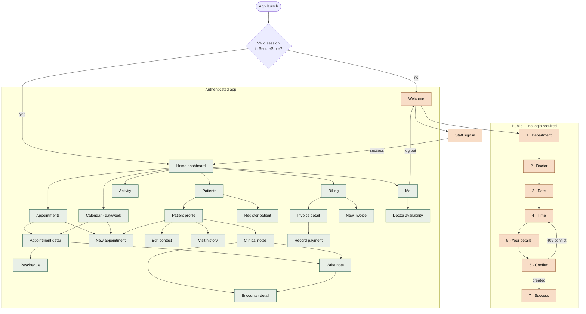

# Screen Map

## Route table

| Route | File | Access |
|---|---|---|
| `/` | `app/index.tsx` | gate — redirects |
| `/(public)/welcome` | `welcome.tsx` | guest |
| `/(public)/login` | `login.tsx` | guest |
| `/(public)/book` | `book/index.tsx` | guest |
| `/(public)/book/practitioner` | `book/practitioner.tsx` | guest |
| `/(public)/book/date` | `book/date.tsx` | guest |
| `/(public)/book/slot` | `book/slot.tsx` | guest |
| `/(public)/book/details` | `book/details.tsx` | guest |
| `/(public)/book/confirm` | `book/confirm.tsx` | guest |
| `/(public)/book/success` | `book/success.tsx` | guest |
| `/(app)/(tabs)` | `(tabs)/index.tsx` | any staff |
| `/(app)/(tabs)/appointments` | `(tabs)/appointments.tsx` | any staff |
| `/(app)/(tabs)/patients` | `(tabs)/patients.tsx` | any staff |
| `/(app)/(tabs)/billing` | `(tabs)/billing.tsx` | billing roles |
| `/(app)/(tabs)/activity` | `(tabs)/activity.tsx` | shown when billing is not available |
| `/(app)/(tabs)/profile` | `(tabs)/profile.tsx` | any staff |
| `/(app)/appointment/[id]` | `appointment/[id]/index.tsx` | any staff |
| `/(app)/appointment/[id]/reschedule` | `appointment/[id]/reschedule.tsx` | booking roles |
| `/(app)/appointment/new` | `appointment/new.tsx` | booking roles |
| `/(app)/patient/[id]` | `patient/[id]/index.tsx` | any staff |
| `/(app)/patient/[id]/edit` | `patient/[id]/edit.tsx` | admin, reception |
| `/(app)/patient/[id]/history` | `patient/[id]/history.tsx` | any staff |
| `/(app)/patient/[id]/notes` | `patient/[id]/notes.tsx` | Physician |
| `/(app)/patient/new` | `patient/new.tsx` | staff |
| `/(app)/encounter/[id]` | `encounter/[id].tsx` | Physician |
| `/(app)/encounter/new` | `encounter/new.tsx` | Physician |
| `/(app)/invoice/[id]` | `invoice/[id].tsx` | billing roles |
| `/(app)/invoice/new` | `invoice/new.tsx` | billing roles |
| `/(app)/calendar` | `calendar/index.tsx` | any staff |
| `/(app)/availability` | `availability/index.tsx` | any staff; editing gated on `can_manage` |

## Guards

* `app/(app)/_layout.tsx` redirects to `/(public)/welcome` whenever there is no
  session — including when a mid-session 401 clears it.
* Each booking step redirects back to `/(public)/book` if the wizard state it
  needs is missing, so a deep link cannot land mid-flow with nothing selected.
* Role gating removes tabs and rows (`href: null`), but the backend still
  enforces every rule.
